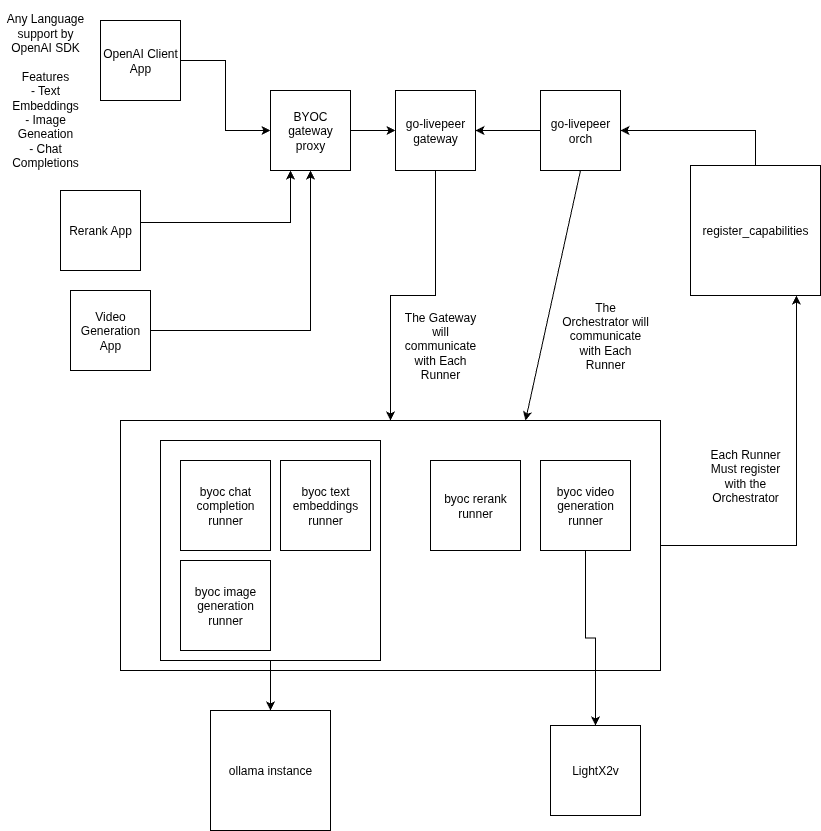

# Livepeer BYOC Suite

**Bring Your Own Compute (BYOC)** extends the Livepeer network by letting node operators run custom AI inference workloads — chat completions, embeddings, image generation, reranking, and video generation — on their own hardware while routing requests through the Livepeer gateway and orchestrator infrastructure.

This repository is a **git-submodule monorepo** that aggregates the five independent service repos that make up the BYOC stack.

## Architecture



**Request flow:** Client → Gateway Proxy → Livepeer Gateway → Orchestrator → Runner

The **Gateway Proxy** translates standard OpenAI/Cohere API calls into Livepeer-routed requests. The **Gateway** and **Orchestrator** (both `go-livepeer`) handle discovery and job routing. **Runners** perform the actual inference, and **Register Capabilities** advertises each runner's abilities to the orchestrator.

## Subprojects

| Subproject | Language | Purpose | README |
|---|---|---|---|
| **gateway-proxy** | Go | Reverse proxy exposing OpenAI-compatible and Cohere-compatible API endpoints in front of the Livepeer Gateway | [README](gateway-proxy/README.md) |
| **openai-runners** | Go / Python | Runners for chat completions, embeddings (via Ollama), and image generation (GPU diffusers) | [README](openai-runners/README.md) |
| **rerank-runner** | Python (FastAPI) | Cohere-compatible reranking with GPU-accelerated CrossEncoder (zerank-2) | [README](rerank-runner/README.md) |
| **video-runner** | Python (FastAPI) | Async multi-clip video generation with LightX2V, Real-ESRGAN upscaling, RIFE interpolation, and S3 delivery | [README](video-runner/README.md) |
| **register-capabilities** | Go | Init container that registers runner capabilities with the orchestrator via retry loop | [README](register-capabilities/README.md) |

## Supported API Endpoints

| Endpoint | Capability | Runner |
|---|---|---|
| `POST /v1/chat/completions` | `openai-chat-completions` | openai-runners (Go) |
| `POST /v1/embeddings` | `openai-text-embeddings` | openai-runners (Go) |
| `POST /v1/images/generations` | `openai-image-generation` | openai-runners (Python) |
| `POST /v1/rerank` | `cohere-rerank` | rerank-runner |
| `POST /v1/video/pipeline/generations` | `video-pipeline-generation` | video-runner |
| `POST /v1/video/pipeline/generations/status` | — | video-runner |

All endpoints are exposed through the **gateway-proxy**. See each subproject's README for request/response details.

## Deployment Order

Each subproject has its own `docker-compose.yml` for its stack. The cross-service startup order is:

1. **Orchestrator** (`go-livepeer`) — must be running first
2. **Runners** (`openai-runners`, `rerank-runner`, `video-runner`) — can start in parallel
3. **Register Capabilities** — one instance per runner; retries until the orchestrator is reachable
4. **Livepeer Gateway** (`go-livepeer`) — connects to the orchestrator
5. **Gateway Proxy** — connects to the Livepeer Gateway

## Getting Started

### Clone the suite

```bash
git clone --recursive git@github.com:Cloud-SPE/livepeer-byoc-suite.git
cd livepeer-byoc-suite
```

### If you already cloned (and submodule folders are empty)

```bash
git submodule update --init --recursive
```

### Pulling latest changes

Update the parent repo and reset all submodules to the pinned commits:

```bash
git pull origin main
git submodule update
```

Update all submodules to their latest remote `main` (ignoring what the parent pins):

```bash
git submodule update --remote
```

### Working in a submodule

Submodules check out in **detached HEAD** state by default. Always checkout a branch before making changes:

```bash
cd openai-runners
git checkout main

# make changes, commit, push
git add .
git commit -m "feat: add streaming timeout config"
git push origin main

# return to parent and update the pointer
cd ..
git add openai-runners
git commit -m "chore: update openai-runners pointer"
git push origin main
```

### Cheatsheet

| Task | Command |
|---|---|
| Clone everything | `git clone --recursive git@github.com:Cloud-SPE/livepeer-byoc-suite.git` |
| Reset to pinned state | `git submodule update` |
| Update all to latest remote | `git submodule update --remote` |
| Check status | `git status` (shows if pointers moved) |
| Add new service | `git submodule add <url> <folder>` |

## Prerequisites

- **Docker + Docker Compose** — every subproject ships a Compose file
- **NVIDIA GPU + CUDA drivers** — required for image generation, reranking, and video runners
- **go-livepeer** — provides the orchestrator and gateway binaries
- **Ollama** — serves LLM and embedding models for openai-runners
- **S3-compatible storage** (e.g. MinIO) — used by video-runner for output delivery

See each subproject's README for detailed environment variables and setup instructions.

## Troubleshooting

### "Reference is not a tree" error

**Symptom:** `git submodule update` fails with a missing commit hash.
**Cause:** A submodule pointer was updated in the parent but the actual commit was never pushed to the child repo.
**Fix:** Ask the person who updated the pointer to push their commits in the child repository (e.g. `gateway-proxy`).

### Detached HEAD in a submodule

**Symptom:** `git status` inside `rerank-runner/` says *"HEAD detached at a1b2c3"*.
**Cause:** Normal submodule behavior — you're viewing a pinned commit, not a branch tip.
**Fix:** If you need to make changes, run `git checkout main` inside the submodule.

### Dirty submodule state

**Symptom:** The parent repo reports a submodule like `video-runner` as modified, but you didn't change the pointer.
**Cause:** Uncommitted changes or untracked files inside the submodule directory.
**Fix:** Enter the submodule, then commit or stash your changes. As a last resort, `git clean -fd` removes untracked files (use with care).

## License

This project is licensed under the [MIT License](LICENSE).
